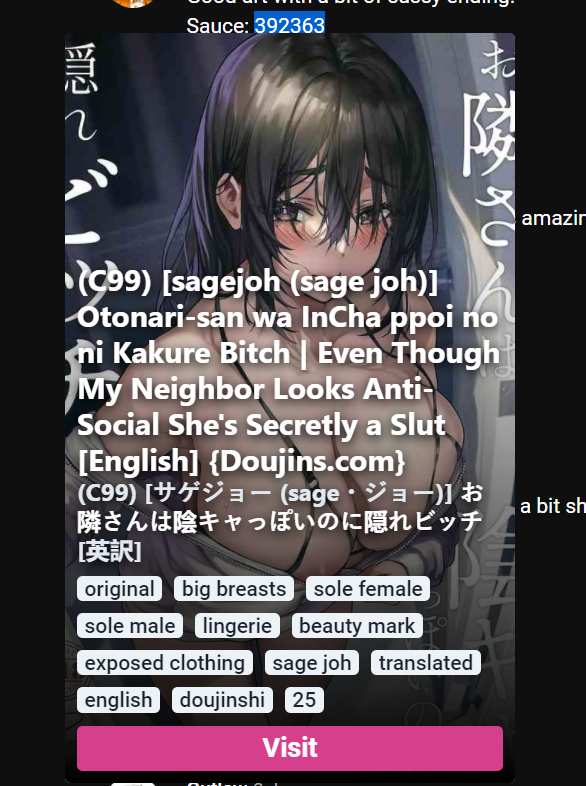

<p align="center">
    
</p>
<p align="center">
    <strong>A Chromium Browser's extension and your friend to solve mysterious 6-digit number in internet :3</strong>
</p>
<p align="center">
    <em>Make sure to run VPN or use Open DNS</em>
</p>

## Demo

_TBD_

## Screenshot



## How to Use

To use this extension, you can download the unpacked extension from [Release](https://github.com/salty-kitsune/penh/releases) page, or follow [How to Build](#how-to-build) to build it from scratch. After that, just load the unpacked assets of this extension to your Chromium Browser. For further information you can checkout this [instruction](https://developer.chrome.com/docs/extensions/mv3/getstarted/#unpacked) to installing unpacked extension.

## How to Build

To build this project in your local, just clone this repository and make sure to install these prerequisites first:

- Node v16+

After that run these commands in your terminal/cmd/powershell :

```sh
# Install dependencies
npm install
```

```sh
# Build project
npm run build
```

The generated assets will be stored in `dist` folder. Finally, load the assets in `dist` folder in Chromium Browser.

## Disclaimer

This project was initialized for research purposes and fun.

## License

[MIT](https://choosealicense.com/licenses/mit/)
